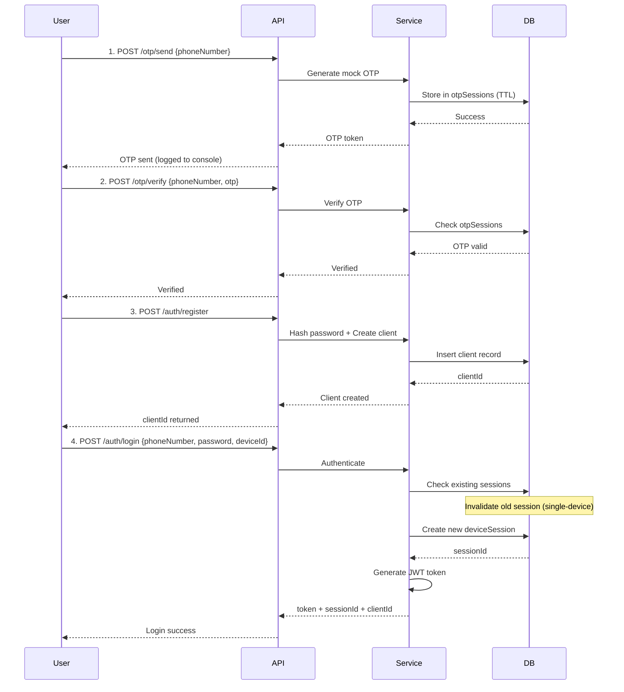
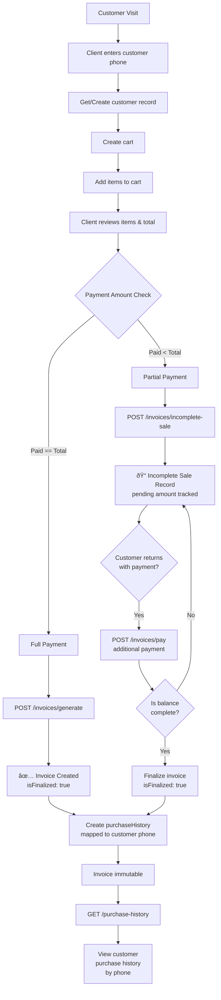

# Viveka Backend

Professional documentation for the Viveka backend (Express + MongoDB).

This README provides a concise architecture overview, API reference, run instructions, testing and deployment notes, and diagrams (Mermaid) for developers and integrators.

--

## Table of contents

- Overview
- Architecture (diagram & flow)
- System Flow Diagram
- Quick start
- Environment

## System Flow Diagram

### Complete User Journey: OTP → Registration → Billing

```mermaid
graph TD
    A[Mobile Client] -->|1. POST /otp/send<br/>phoneNumber| B[OTP Controller]
    B -->|Validate phone| C[OTP Service]
    C -->|Store in DB<br/>otpSessions| D[(MongoDB)]
    C -->|Return OTP| B
    B -->|Return success| A

    A -->|2. POST /otp/verify<br/>phoneNumber, OTP| B
    B -->|Verify against DB| C
    C -->|Match OTP| D
    D -->|Success| C
    C -->|Return verified| B
    B -->|Return success| A

    A -->|3. POST /auth/register<br/>phoneNumber, password,<br/>ownerName, businessName| E[Auth Controller]
    E -->|Hash password| F[Auth Service]
    F -->|Create client record| D
    D -->|clientId generated| F
    F -->|Return clientId| E
    E -->|Return success| A

    A -->|4. POST /auth/login<br/>phoneNumber, password,<br/>deviceId, deviceName| E
    E -->|Verify credentials| F
    F -->|Check device policy<br/>one-user-one-device| D
    D -->|Invalidate prev session| F
    F -->|Create deviceSession<br/>Generate JWT| D
    D -->|Return token| F
    F -->|Return token,<br/>clientId, sessionId| E
    E -->|Return success| A

    A -->|5a. POST /business/item-groups<br/>clientId, name, description| G[Business Controller]
    G -->|Create group| H[Business Service]
    H -->|Insert itemGroups| D
    D -->|groupId| H
    H -->|Return groupId| G
    G -->|Return success| A

    A -->|5b. POST /business/items<br/>clientId, name, price,<br/>unit, groupId| G
    G -->|Create item| H
    H -->|Insert items| D
    D -->|itemId| H
    H -->|Return itemId| G
    G -->|Return success| A

    A -->|6. POST /business/customers<br/>clientId, phoneNumber| G
    G -->|Get/Create customer| H
    H -->|Query customers<br/>by phone| D
    D -->|customerId| H
    H -->|Return customerId| G
    G -->|Return success| A

    A -->|7. POST /business/carts<br/>clientId, customerPhone| G
    G -->|Create cart| H
    H -->|Insert carts| D
    D -->|cartId| H
    H -->|Return cartId| G
    G -->|Return success| A

    A -->|8. POST /business/carts/add-item<br/>cartId, itemId, quantity,<br/>unitPrice| G
    G -->|Add to cart| H
    H -->|Insert cartItems| D
    D -->|Success| H
    H -->|Return cartItemId| G
    G -->|Return success| A

    A -->|9. GET /business/carts/:cartId| G
    G -->|Fetch cart| H
    H -->|Query cartItems| D
    D -->|Return items & total| H
    H -->|Calculate total| H
    H -->|Return cart data| G
    G -->|Return cart| A

    A -->|10a. Payment Check:<br/>Paid == Total?| A
    A -->|YES: Full Payment| I{Generate Invoice}
    A -->|NO: Partial Payment| J{Incomplete Sale}

    I -->|POST /business/invoices/generate<br/>clientId, customerId, cartId,<br/>totalAmount, paidAmount| G
    G -->|Validate payment| H
    H -->|paidAmount == totalAmount?| H
    H -->|YES: Create invoice| D
    D -->|invoiceId, isFinalized=true| H
    H -->|Also create purchaseHistory| D
    D -->|Success| H
    H -->|Return invoice| G
    G -->|Return success| A

    J -->|POST /business/invoices/incomplete-sale<br/>clientId, customerPhone, cartId,<br/>totalAmount, paidAmount| G
    G -->|Record partial sale| H
    H -->|Create incompleteSale record| D
    D -->|Success| H
    H -->|Return success| G
    G -->|Return success| A

    A -->|11. GET /business/purchase-history/:clientId| G
    G -->|Fetch history| H
    H -->|Query purchaseHistories| D
    D -->|Return history by phone| H
    H -->|Return history| G
    G -->|Return history| A
```



### Core Architecture Layers

```mermaid
graph LR
    subgraph CLIENT["📱 Client Layer"]
        FA["Frontend App<br/>Mobile Device"]
    end

    subgraph API["🌐 API Layer"]
        AR["Routes<br/>authRoutes<br/>businessRoutes<br/>otpRoutes"]
        AC["Controllers<br/>authController<br/>businessController<br/>otpController"]
    end

    subgraph SERVICE["⚙️ Service Layer"]
        AS["Services<br/>authService<br/>businessService<br/>otpService"]
    end

    subgraph DATA["💾 Data Layer"]
        DB["MongoDB<br/>Collections:<br/>clients, devices,<br/>otpSessions, items,<br/>itemGroups, customers,<br/>carts, invoices,<br/>purchaseHistories"]
    end

    FA -->|HTTP Requests| AR
    AR -->|Route to| AC
    AC -->|Business Logic| AS
    AS -->|CRUD Operations| DB
    DB -->|Data Response| AS
    AS -->|Formatted Response| AC
    AC -->|JSON Response| AR
    AR -->|HTTP Response| FA
```



### Authentication & Device Flow



### Billing & Invoice Flow



## API Reference (detailed)

Base URL: `http://localhost:5000/api`

Notes: endpoints use JSON. Where applicable include `Authorization: Bearer <token>` header and/or `clientId` in the request body as indicated.

### OTP

- POST /otp/send

  - Auth: none
  - Body example:
    ```json
    { "phoneNumber": "9890000000" }
    ```
  - Success response (200):
    ```json
    {
      "success": true,
      "message": "OTP sent (mock)",
      "data": { "phoneNumber": "9890000000" }
    }
    ```
  - Notes: OTP is logged to server console for tests; TTL and attempt limits apply.

- POST /otp/verify

  - Auth: none
  - Body example:
    ```json
    { "phoneNumber": "9890000000", "otp": "1234" }
    ```
  - Success response (200):
    ```json
    { "success": true, "message": "OTP verified" }
    ```

- POST /otp/clear
  - Auth: none
  - Body example:
    ```json
    { "phoneNumber": "9890000000" }
    ```
  - Success response (200):
    ```json
    { "success": true, "message": "OTP session cleared" }
    ```

### Auth

- POST /auth/register

  - Auth: none
  - Body example:
    ```json
    {
      "phoneNumber": "9890000000",
      "password": "Pass123!",
      "ownerName": "Alice",
      "businessName": "Alice Supplies"
    }
    ```
  - Success response (201):
    ```json
    {
      "success": true,
      "message": "Client registered",
      "data": { "clientId": "<clientId>" }
    }
    ```

- POST /auth/login

  - Auth: none
  - Body example:
    ```json
    {
      "phoneNumber": "9890000000",
      "password": "Pass123!",
      "deviceId": "device-1",
      "deviceName": "POS-1"
    }
    ```
  - Success response (200):
    ```json
    {
      "success": true,
      "message": "Login successful",
      "data": {
        "token": "<jwt>",
        "clientId": "<clientId>",
        "deviceSessionId": "<sessionId>"
      }
    }
    ```
  - Notes: previous device sessions for the same client are invalidated (single-device policy).

- POST /auth/logout

  - Auth: none (body requires clientId + deviceSessionId)
  - Body example:
    ```json
    { "clientId": "<clientId>", "deviceSessionId": "<sessionId>" }
    ```
  - Success response (200):
    ```json
    { "success": true, "message": "Logged out" }
    ```

- GET /auth/client/:clientId
  - Auth: token or clientId in request depending on implementation
  - Response (200):
    ```json
    {
      "success": true,
      "data": {
        "clientId": "<clientId>",
        "ownerName": "Alice",
        "businessName": "Alice Supplies",
        "phoneNumber": "989..."
      }
    }
    ```

### Item Groups

- POST /business/item-groups

  - Auth: clientId required in body
  - Body example:
    ```json
    {
      "clientId": "<clientId>",
      "name": "Engine Parts",
      "description": "All engine-related spare parts"
    }
    ```
  - Success (201):
    ```json
    { "success": true, "data": { "groupId": "<groupId>" } }
    ```

- GET /business/item-groups/:clientId

  - Auth: none (clientId path param)
  - Success (200):
    ```json
    { "success": true, "data": [{ "groupId": "g1", "name": "Engine Parts" }] }
    ```

- PUT /business/item-groups/:clientId/:groupId

  - Body example:
    ```json
    { "name": "Engine Parts - Updated", "description": "Updated description" }
    ```
  - Success (200):
    ```json
    { "success": true, "message": "Item group updated" }
    ```

- DELETE /business/item-groups/:clientId/:groupId
  - Success (200): `{ "success": true, "message": "Item group deleted" }`

### Items

- POST /business/items

  - Body example:
    ```json
    {
      "clientId": "<clientId>",
      "name": "Carburetor",
      "price": 2500,
      "unit": "nos",
      "groupId": "<groupId>",
      "description": "2-barrel carburetor"
    }
    ```
  - Success (201): `{ "success": true, "data": { "itemId":"<itemId>" } }`

- GET /business/items/:clientId

  - Returns list of items; filter by `groupId` optional.
  - Query param: `?groupId=<groupId>`

- PUT /business/items/:clientId/:itemId

  - Body allows `name`, `price`, `unit`, `description`, `groupId` updates.
  - Success (200):
    ```json
    { "success": true, "message": "Item updated" }
    ```

- DELETE /business/items/:clientId/:itemId
  - Success (200): `{ "success": true, "message": "Item deleted" }`

### Customers

- POST /business/customers

  - Body example:
    ```json
    { "clientId": "<clientId>", "phoneNumber": "9891112222", "name": "Bob" }
    ```
  - Success (200): returns `customerId`.

- GET /business/customers/:clientId
  - List customers for the client.

### Cart

- POST /business/carts

  - Create cart for a customer. Body:
    ```json
    { "clientId": "<clientId>", "customerPhone": "9891112222" }
    ```
  - Success (201): `{ "success": true, "data": { "cartId": "<cartId>" } }`

- POST /business/carts/add-item

  - Add item to cart. Body:
    ```json
    {
      "cartId": "<cartId>",
      "itemId": "<itemId>",
      "itemName": "Carburetor",
      "unitPrice": 2500,
      "quantity": 2
    }
    ```
  - Success (200): `{ "success": true, "data": { "cartItemId": "<cartItemId>" } }`

- GET /business/carts/:cartId

  - Returns cart contents and totals.

- POST /business/carts/remove-item

  - Body: `{ "cartId":"<cartId>", "cartItemId":"<cartItemId>" }`
  - Success (200): `{ "success": true, "message": "Item removed from cart" }`

- POST /business/carts/clear
  - Body: `{ "cartId":"<cartId>" }` — clears cart items.
  - Success (200): `{ "success": true, "message": "Cart cleared" }`

### Invoices & Payments

Invoices must be generated only when the bill is paid in full. For partial or installment payments, use the `incomplete-sale` flow; an invoice will not be created until the full amount is received.

- POST /business/invoices/generate (create invoice)

  - Body example (invoice creation requires full payment):
    ```json
    {
      "clientId": "<clientId>",
      "customerId": "<customerId>",
      "cartId": "<cartId>",
      "totalAmount": 5000,
      "paidAmount": 5000,
      "notes": "Full payment received"
    }
    ```
  - Success (201):
    ```json
    {
      "success": true,
      "invoice": {
        "_id": "<invoiceId>",
        "totalAmount": 5000,
        "paidAmount": 5000,
        "isFinalized": true
      }
    }
    ```
  - Notes: If `paidAmount` is less than `totalAmount` the API will return an error instructing to use `/business/invoices/incomplete-sale` instead.

- POST /business/invoices/incomplete-sale

  - Create incomplete sale record when paid < total. Body:
    ```json
    {
      "clientId": "<clientId>",
      "customerPhone": "9891112222",
      "cartId": "<cartId>",
      "totalAmount": 5000,
      "paidAmount": 2500,
      "notes": "Partial payment - pending 2500"
    }
    ```
  - Success (201):
    ```json
    {
      "success": true,
      "message": "Incomplete sale recorded"
    }
    ```

- POST /business/invoices/pay (record additional payment)

  - Body example:
    ```json
    {
      "clientId": "<clientId>",
      "invoiceId": "<invoiceId>",
      "amount": 2500,
      "method": "cash",
      "note": "Additional payment"
    }
    ```
  - Success (200):
    ```json
    {
      "success": true,
      "payment": { "_id": "<paymentId>", "amount": 2500 },
      "invoice": {
        "_id": "<invoiceId>",
        "paidAmount": 5000,
        "isFinalized": true
      }
    }
    ```

- GET /business/invoices/:invoiceId/payments

  - Returns array of payments recorded for the invoice.

- GET /business/invoices/:clientId

  - Returns invoices for the client; each invoice contains `totalAmount`, `paidAmount`, `isFinalized` and timestamps.

- GET /business/purchase-history/:clientId

  - Returns purchase history; optional filter by `customerId`.
  - Query param: `?customerId=<customerId>`

For full request/response examples, see `documentation/POSTMAN_GUIDE.md` or the Postman collection in `documentation/`.

## Quick start (developer)

1. Install dependencies

```bash
cd Backend
npm install
```

2. Create `.env` in `Backend` (example):

```
MONGO_URL=mongodb://localhost:27017/viveka
PORT=5000
JWT_SECRET=change_me
NODE_ENV=development
```

3. Start MongoDB (local or Docker)

```bash
# local
mongod --dbpath /path/to/db

# or docker
docker run -d -p 27017:27017 --name mongodb mongo:latest
```

4. Start server

```bash
npm start
```

5. Run automated tests (server must be running)

```bash
npm test
```

## Environment variables

- `MONGO_URL` — MongoDB connection string
- `PORT` — HTTP port (default 5000)
- `JWT_SECRET` — secret for signing JWT tokens
- `NODE_ENV` — environment (development/production)

## Project layout

Key folders and files:

- `src/api/controllers` — request handlers
- `src/api/routes` — route definitions
- `src/services` — business logic (OTP, auth, business)
- `src/models/Model.js` — Mongoose schemas
- `src/config/db.js` — DB connection
- `tests/test.js` — automated A→Z API test suite (reports)
- `documentation/` — project docs and Postman guides

## API Reference (summary)

Base URL: `http://localhost:5000/api`

Authentication: Most business endpoints require a valid `clientId` and/or a JWT `Authorization: Bearer <token>` depending on the endpoint. The suite primarily uses `clientId` for scoping.

Endpoints (grouped) — concise reference with method, path, auth and purpose.

- OTP

  - POST `/otp/send` — body: `{ phoneNumber }` — send mock OTP (no SMS)
  - POST `/otp/verify` — body: `{ phoneNumber, otp }` — verify otp
  - POST `/otp/clear` — body: `{ phoneNumber }` — clear OTP session

- Auth

  - POST `/auth/register` — body: `{ phoneNumber, password, ownerName, businessName }` — create client
  - POST `/auth/login` — body: `{ phoneNumber, password, deviceId, deviceName }` — authenticate and create device session
  - POST `/auth/logout` — body: `{ clientId, deviceSessionId }` — logout device
  - GET `/auth/client/:clientId` — path param: `clientId` — get client details

- Business (Item groups, Items, Customers, Cart, Invoice)

  - POST `/business/item-groups` — create item group
  - GET `/business/item-groups/:clientId` — list groups
  - PUT `/business/item-groups/:clientId/:groupId` — update group
  - DELETE `/business/item-groups/:clientId/:groupId` — delete group

  - POST `/business/items` — create item (clientId, name, price, unit, groupId opt)
  - GET `/business/items/:clientId` — list items (query: groupId optional)
  - PUT `/business/items/:clientId/:itemId` — update item
  - DELETE `/business/items/:clientId/:itemId` — delete item

  - POST `/business/customers` — create/get customer by phone
  - GET `/business/customers/:clientId` — list customers

  - POST `/business/carts` — create cart for a customer
  - POST `/business/carts/add-item` — add item to cart
  - GET `/business/carts/:cartId` — get cart
  - POST `/business/carts/remove-item` — remove item from cart
  - POST `/business/carts/clear` — clear cart

  - POST `/business/invoices/generate` — generate invoice (must meet paid==total rule)
  - POST `/business/invoices/incomplete-sale` — record incomplete sale (paid < total)
  - POST `/business/invoices/pay` — record additional payment against invoice
  - GET `/business/invoices/:invoiceId/payments` — get payments for invoice
  - GET `/business/invoices/:clientId` — list invoices
  - GET `/business/purchase-history/:clientId` — list purchase history (query customerId opt)

For full request/response examples, see `documentation/POSTMAN_GUIDE.md` or the Postman collection in `documentation/`.

## Authentication & Device Sessions

- Passwords are hashed with `bcrypt`.
- JWT tokens are issued on login and used to authorize actions where required.
- Single-device policy: on new login a previous device session for the same client is invalidated.

## Error handling

The API returns JSON with at least `{ success: boolean, message: string, data?: any }`.

Common HTTP codes used:

- `200` OK — successful read/write operations
- `201` Created — resource created
- `400` Bad Request — validation failed
- `401` Unauthorized — auth failure
- `404` Not Found — resource missing
- `500` Server Error — unexpected errors

## Testing & Reports

- `tests/test.js` runs a full A→Z suite that clears test collections, executes flows (OTP → auth → items → cart → invoice) and generates:
  - `tests/test-report.json` (machine readable)
  - `tests/test-report.html` (visual)
- The test harness uses the same `node_modules` from the project root; ensure the server is running before executing tests.

## Deployment notes

- Use `NODE_ENV=production` and a secure `JWT_SECRET` in production.
- Ensure TLS termination (HTTPS) is used in front of the API.
- Scale: the app is stateless apart from MongoDB; multiple instances can run behind a load balancer.

## Example cURL snippets

Register client:

```bash
curl -X POST http://localhost:5000/api/auth/register \
	-H "Content-Type: application/json" \
	-d '{"phoneNumber":"9890000000","password":"Pass123!","ownerName":"Alice","businessName":"Alice Supplies"}'
```

Login:

```bash
curl -X POST http://localhost:5000/api/auth/login \
	-H "Content-Type: application/json" \
	-d '{"phoneNumber":"9890000000","password":"Pass123!","deviceId":"device-1"}'
```

Create item group (authenticated by `clientId` in body):

```bash
curl -X POST http://localhost:5000/api/business/item-groups \
	-H "Content-Type: application/json" \
	-d '{"clientId":"<clientId>","name":"Beverages"}'
```

## Contributing

- Follow existing code style (ES modules, consistent naming).
- Add unit/integration tests to `tests/` for new endpoints.
- Open PRs against `main` and include test results.

## License

MIT — see `package.json` for details.
