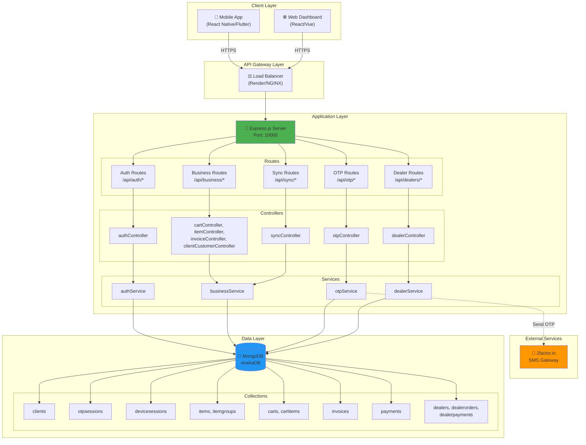
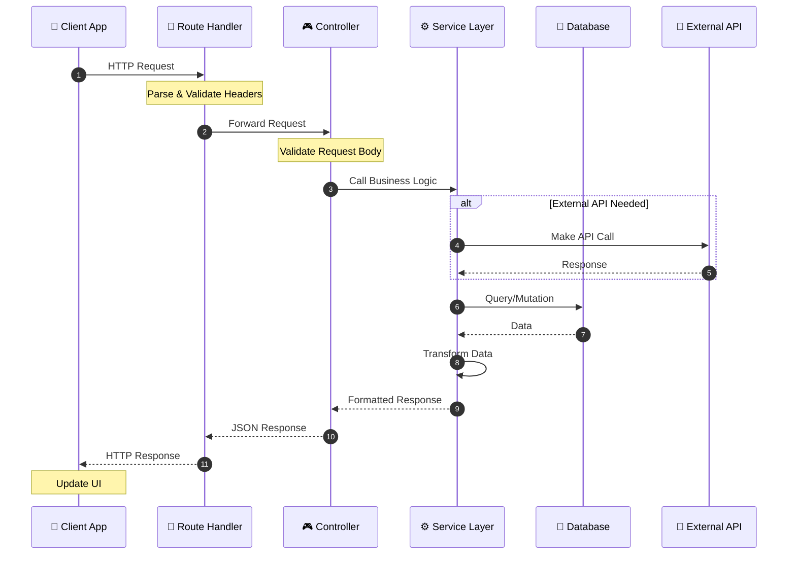
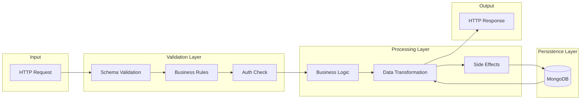
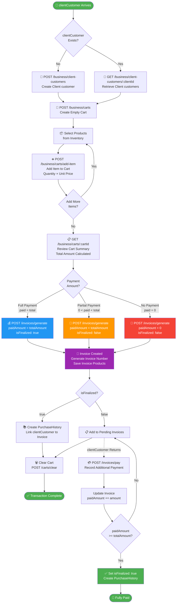
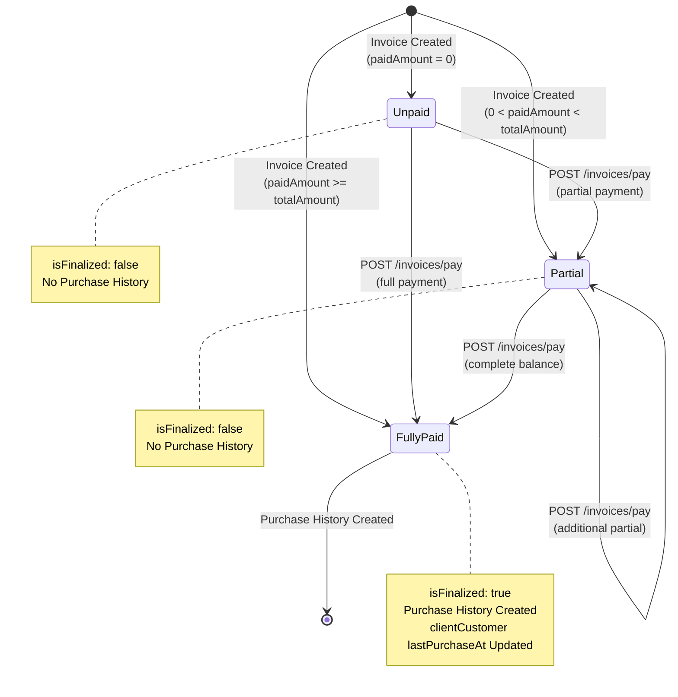
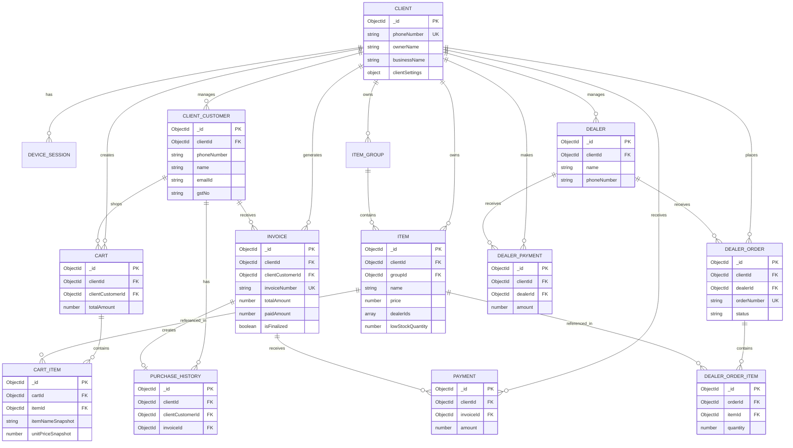

# Viveka Backend API

> **Enterprise-Grade B2B Billing & Invoicing System**  
> Built with Node.js, Express, and MongoDB

[](https://github.com/viveka/backend)
[](LICENSE)
[](https://nodejs.org)

---

## 📋 Table of Contents

- [Overview](#overview)
- [API Documentation](API_DOCUMENTATION.md)
- [System Architecture](#system-architecture)
- [Workflow Diagrams](#workflow-diagrams)
- [Module Documentation](#module-documentation)
- [Database Schema](#database-schema)
- [Quick Start](#quick-start)
- [Testing](#testing)
- [Configuration](#configuration)

---

## 🎯 Overview

Viveka Backend is a comprehensive **B2B billing and invoicing system** designed for small to medium businesses. The platform provides:

- **OTP-Based Authentication**: Secure, passwordless authentication using SMS OTP
- **Multi-Tenant Architecture**: Isolated data per business client
- **Inventory Management**: Item groups, products, and pricing
- **Cart & Billing**: Shopping cart with real-time calculations
- **Invoice Generation**: Immediate invoice creation with flexible payment options
- **Payment Tracking**: Support for partial and full payments
- **clientCustomer Management**: clientCustomer records with purchase history
- **Offline-First Design**: Queue-based sync for intermittent connectivity
- **RESTful API**: Clean, well-documented endpoints

### Key Features

✅ **Zero-Password Authentication** - OTP via SMS (2factor.in)  
✅ **Single-Device Policy** - One active session per client  
✅ **Flexible Payments** - Partial, full, or deferred payments  
✅ **Historical Snapshots** - Price and item name preservation  
✅ **TTL-Based Cleanup** - Auto-expiring OTP and cart sessions  
✅ **Idempotency Support** - Safe retry mechanism for offline sync  
✅ **Production-Ready** - Deployed on Render with MongoDB Atlas

### Technology Stack

| Layer      | Technology   | Purpose                        |
| ---------- | ------------ | ------------------------------ |
| Runtime    | Node.js v18+ | JavaScript runtime             |
| Framework  | Express.js   | Web framework and routing      |
| Database   | MongoDB      | NoSQL document store           |
| ODM        | Mongoose     | Schema modeling and validation |
| Auth       | JWT          | Token-based authentication     |
| SMS        | 2factor.in   | OTP delivery service           |
| Deployment | Render       | Cloud hosting platform         |

---

## 🏗️ System Architecture

---

## 🏗️ System Architecture

### High-Level Architecture

The Viveka backend follows a **layered architecture pattern** with clear separation of concerns:



### Request Flow



### Data Flow Architecture



---

## 📊 Workflow Diagrams

### 1. Authentication & Registration Flow

```mermaid
sequenceDiagram
    autonumber
    participant User as 👤 User
    participant App as 📱 Mobile App
    participant API as 🚀 API Server
    participant OTPSvc as 📧 OTP Service
    participant SMS as 📲 2factor.in
    participant DB as 💾 Database

    rect rgb(17, 24, 29)
        Note over User,DB: Registration Flow
        User->>App: Enter Phone Number
        App->>API: POST /otp/send<br/>{phone, purpose: "register"}
        Note over App,API: Use /mockotp/send for testing (fixed OTP = 1234)
        API->>OTPSvc: Generate OTP
        OTPSvc->>OTPSvc: Hash OTP (bcrypt)
        OTPSvc->>DB: Store OTPSession<br/>(TTL: 10 min)
        OTPSvc->>SMS: Send SMS
        SMS-->>User: SMS with OTP (1234)
        API-->>App: {success: true, expiresInSeconds: 600}

        User->>App: Enter OTP + Profile Details
        App->>API: POST /auth/register<br/>{phone, otp, ownerName, businessName...}
        API->>OTPSvc: Verify OTP
        OTPSvc->>DB: Check OTPSession
        alt OTP Valid
            DB-->>OTPSvc: OTP Matched
            OTPSvc->>DB: Create Client Record
            DB-->>API: clientId
            API-->>App: {success: true, clientId}
            App->>User: Registration Success
        else OTP Invalid/Expired
            DB-->>OTPSvc: Not Found/Expired
            API-->>App: {success: false, message: "Invalid OTP"}
            App->>User: Show Error
        end
    end

    rect rgb(41, 37, 31)
        Note over User,DB: Login Flow
        User->>App: Enter Phone Number (Login)
        App->>API: POST /otp/send<br/>{phone, purpose: "login"}
        Note over App,API: Use /mockotp/send for testing (fixed OTP = 1234)
        API->>OTPSvc: Generate OTP
        OTPSvc->>DB: Store OTPSession
        OTPSvc->>SMS: Send SMS
        SMS-->>User: SMS with OTP (4321)

        User->>App: Enter OTP
        App->>API: POST /auth/login<br/>{phone, otp}
        API->>OTPSvc: Verify OTP
        OTPSvc->>DB: Check OTPSession
        alt OTP Valid
            OTPSvc->>DB: Invalidate Old DeviceSession
            OTPSvc->>DB: Create New DeviceSession
            OTPSvc->>OTPSvc: Generate JWT (30d expiry)
            API-->>App: {token, deviceSessionId, clientId}
            App->>User: Login Success
        else OTP Invalid
            API-->>App: {success: false}
            App->>User: Show Error
        end
    end
```



### 2. Complete Billing Workflow



### 3. Payment Lifecycle



---
 
## 🗄️ Database Schema

### Schema Overview

Viveka uses **MongoDB** as the primary database with **Mongoose ODM** for schema modeling and validation.

**Design Principles:**

- **Multi-Tenancy:** All business data scoped by `clientId`
- **Phone-Based Identity:** Clients and clientCustomers identified by phone numbers
- **TTL Indexes:** Auto-expiring sessions (OTP, Cart)
- **Snapshots:** Historical price/name preservation in carts and invoices
- **Soft Deletes:** Items marked inactive, not deleted
- **Single-Device Policy:** One active session per client

---

### 1. Client Schema

**Collection:** `clients`

**Purpose:** Store business owner (client) profiles and credentials.

#### Fields

| Field                                   | Type    | Required | Default | Description            | Constraints                 |
| --------------------------------------- | ------- | -------- | ------- | ---------------------- | --------------------------- |
| `phoneNumber`                           | String  | ✅       | -       | Business phone         | 10+ digits, unique, indexed |
| `ownerName`                             | String  | ✅       | -       | Owner's full name      | Min 2 chars                 |
| `businessName`                          | String  | ✅       | -       | Business legal name    | Min 2 chars                 |
| `shopName`                              | String  | ❌       | ''      | Display/shop name      | -                           |
| `location`                              | String  | ❌       | ''      | Full address           | Max 500 chars               |
| `city`                                  | String  | ❌       | ''      | City name              | -                           |
| `state`                                 | String  | ❌       | ''      | State name             | -                           |
| `gstin`                                 | String  | ❌       | ''      | GST number             | GST format                  |
| `profileUrl`                            | String  | ❌       | ''      | Logo/profile image URL | Valid URL                   |
| `clientSettings`                        | Object  | ❌       | -       | Client preferences     | Contains customerFields     |
| `clientSettings.customerFields.address` | Boolean | ❌       | false   | Track customer address | -                           |
| `clientSettings.customerFields.gstNo`   | Boolean | ❌       | false   | Track customer GST     | -                           |
| `clientSettings.customerFields.emailId` | Boolean | ❌       | false   | Track customer email   | -                           |
| `isActive`                              | Boolean | ❌       | true    | Account status         | Indexed                     |
| `createdAt`                             | Date    | ❌       | now     | Registration time      | Immutable                   |
| `lastLoginAt`                           | Date    | ❌       | null    | Last login timestamp   | -                           |

#### Indexes

- `phoneNumber`: Unique, ascending
- `isActive`: Ascending

#### Example Document

```json
{
  "_id": "507f1f77bcf86cd799439011",
  "phoneNumber": "9890000000",
  "ownerName": "Alice Johnson",
  "businessName": "Alice Auto Spares Pvt Ltd",
  "shopName": "Alice's Auto Shop",
  "location": "123 Main Street, Downtown Area",
  "city": "Bangalore",
  "state": "Karnataka",
  "gstin": "18AADCA1111K1Z5",
  "profileUrl": "https://example.com/logo.png",
  "clientSettings": {
    "customerFields": {
      "address": false,
      "gstNo": false,
      "emailId": false
    }
  },
  "isActive": true,
  "createdAt": "2025-01-12T10:00:00.000Z",
  "lastLoginAt": "2025-01-12T12:30:00.000Z"
}
```

#### Business Rules

- Phone number **immutable** after registration
- Only one client per phone number
- Inactive clients cannot login
- `clientSettings.customerFields` controls optional customer field collection

---

### 2. OtpSession Schema

**Collection:** `otpsessions`

**Purpose:** Temporary storage for OTP verification during registration/login.

#### Fields

| Field         | Type    | Required | Default   | Description           | Constraints                    |
| ------------- | ------- | -------- | --------- | --------------------- | ------------------------------ |
| `phoneNumber` | String  | ✅       | -         | User's phone          | Indexed                        |
| `purpose`     | String  | ❌       | 'generic' | OTP purpose           | `register`, `login`, `generic` |
| `otpHash`     | String  | ✅       | -         | Bcrypt hashed OTP     | -                              |
| `expiresAt`   | Date    | ✅       | -         | Expiration timestamp  | TTL index                      |
| `isVerified`  | Boolean | ❌       | false     | Verification status   | -                              |
| `attempts`    | Number  | ❌       | 0         | Verification attempts | Max 5                          |
| `createdAt`   | Date    | ❌       | now       | Creation time         | Immutable                      |

#### Indexes

- `{ phoneNumber: 1, purpose: 1 }`: Compound index
- `expiresAt`: TTL index (expires documents at this timestamp)

#### TTL Behavior

```javascript
expiresAt: new Date(Date.now() + 10 * 60 * 1000); // 10 minutes
```

MongoDB automatically deletes documents when `expiresAt` is reached.

#### Example Document

```json
{
  "_id": "607f1f77bcf86cd799439015",
  "phoneNumber": "9890000000",
  "purpose": "register",
  "otpHash": "$2b$10$abc123...",
  "expiresAt": "2025-01-12T10:10:00.000Z",
  "isVerified": false,
  "attempts": 0,
  "createdAt": "2025-01-12T10:00:00.000Z"
}
```

#### Business Rules

- One OTP session per phone + purpose
- Auto-deleted after 10 minutes
- Max 5 verification attempts
- OTP consumed (deleted) on successful verification

---

### 3. DeviceSession Schema

**Collection:** `devicesessions`

**Purpose:** Track active device sessions (single-device policy).

#### Fields

| Field        | Type     | Required | Default | Description         | Constraints |
| ------------ | -------- | -------- | ------- | ------------------- | ----------- |
| `clientId`   | ObjectId | ✅       | -       | Reference to Client | Indexed     |
| `deviceId`   | String   | ✅       | -       | Device identifier   | -           |
| `isActive`   | Boolean  | ❌       | true    | Session status      | Indexed     |
| `lastSeenAt` | Date     | ❌       | now     | Last activity time  | -           |
| `createdAt`  | Date     | ❌       | now     | Session creation    | Immutable   |

#### Indexes

- `{ clientId: 1, deviceId: 1 }`: Unique compound index
- `isActive`: Ascending

#### Example Document

```json
{
  "_id": "607f1f77bcf86cd799439012",
  "clientId": "507f1f77bcf86cd799439011",
  "deviceId": "device_abc123",
  "isActive": true,
  "lastSeenAt": "2025-01-12T12:30:00.000Z",
  "createdAt": "2025-01-12T10:00:00.000Z"
}
```

#### Business Rules

- Only one active session per client
- New login invalidates previous session
- Session tracks last seen for monitoring

---

### 4. clientCustomer Schema

**Collection:** `clientCustomers`

**Purpose:** Store end clientCustomers (buyers) for each client.

#### Fields

| Field            | Type     | Required | Default | Description            | Constraints   |
| ---------------- | -------- | -------- | ------- | ---------------------- | ------------- |
| `clientId`       | ObjectId | ✅       | -       | Reference to Client    | Indexed       |
| `phoneNumber`    | String   | ✅       | -       | clientCustomer phone   | 10+ digits    |
| `name`           | String   | ❌       | ''      | clientCustomer name    | Min 2 chars   |
| `address`        | String   | ❌       | ''      | clientCustomer address | Max 500 chars |
| `emailId`        | String   | ❌       | ''      | clientCustomer email   | -             |
| `gstNo`          | String   | ❌       | ''      | clientCustomer GST     | -             |
| `firstSeenAt`    | Date     | ❌       | now     | First transaction      | Immutable     |
| `lastPurchaseAt` | Date     | ❌       | null    | Last purchase time     | -             |

#### Indexes

- `{ clientId: 1, phoneNumber: 1 }`: Unique compound index
- `clientId`: Ascending

#### Example Document

```json
{
  "_id": "607f1f77bcf86cd799439030",
  "clientId": "507f1f77bcf86cd799439011",
  "phoneNumber": "9891112222",
  "name": "Bob Smith",
  "address": "123 Customer Lane, City",
  "emailId": "bob@example.com",
  "gstNo": "29ABCDE1234F1Z5",
  "firstSeenAt": "2025-01-12T10:00:00.000Z",
  "lastPurchaseAt": "2025-01-12T10:05:00.000Z"
}
```

#### Business Rules

- Phone unique per client (multi-tenancy)
- Customers identified by phone for offline scenarios
- `lastPurchaseAt` updated when invoice finalized
- Optional fields (`emailId`, `gstNo`, `address`) controlled by client settings

---

### 5. ItemGroup Schema

**Collection:** `itemgroups`

**Purpose:** Categorize inventory items (e.g., "Engine Parts", "Brake Parts").

#### Fields

| Field         | Type     | Required | Default | Description         |
| ------------- | -------- | -------- | ------- | ------------------- |
| `clientId`    | ObjectId | ✅       | -       | Reference to Client |
| `name`        | String   | ✅       | -       | Group name          |
| `description` | String   | ❌       | ''      | Group description   |
| `createdAt`   | Date     | ❌       | now     | Creation time       |
| `updatedAt`   | Date     | ❌       | now     | Last update time    |

#### Indexes

- `clientId`: Ascending

#### Example Document

```json
{
  "_id": "507f1f77bcf86cd799439013",
  "clientId": "507f1f77bcf86cd799439011",
  "name": "Engine Parts",
  "description": "All engine-related spare parts",
  "createdAt": "2025-01-12T10:00:00.000Z",
  "updatedAt": "2025-01-12T10:00:00.000Z"
}
```

---

### 6. Item Schema

**Collection:** `items`

**Purpose:** Product catalog for each client.

#### Fields

| Field              | Type     | Required | Default | Description               | Constraints                          |
| ------------------ | -------- | -------- | ------- | ------------------------- | ------------------------------------ |
| `clientId`         | ObjectId | ✅       | -       | Reference to Client       | Indexed                              |
| `groupId`          | ObjectId | ❌       | null    | Reference to ItemGroup    | -                                    |
| `name`             | String   | ✅       | -       | Item name                 | Min 2 chars                          |
| `price`            | Number   | ✅       | -       | Unit price                | >= 0                                 |
| `dealerIds`        | Array    | ❌       | []      | Supplier dealer refs      | Array of ObjectIds                   |
| `stock`            | Number   | ❌       | 0       | Stock quantity            | >= 0                                 |
| `lowStockQuantity` | Number   | ❌       | 5       | Low stock alert threshold | >= 0                                 |
| `unit`             | String   | ❌       | 'nos'   | Unit of measure           | `nos`, `kg`, `litre`, `meter`, `pcs` |
| `description`      | String   | ❌       | ''      | Item description          | Max 500 chars                        |
| `isActive`         | Boolean  | ❌       | true    | Item status               | Indexed                              |
| `createdAt`        | Date     | ❌       | now     | Creation time             | Immutable                            |
| `updatedAt`        | Date     | ❌       | now     | Last update time          | -                                    |

#### Indexes

- `clientId`: Ascending
- `isActive`: Ascending

#### Example Document

```json
{
  "_id": "507f1f77bcf86cd799439020",
  "clientId": "507f1f77bcf86cd799439011",
  "groupId": "507f1f77bcf86cd799439013",
  "name": "Carburetor",
  "price": 2500,
  "dealerIds": ["507f1f77bcf86cd799439090", "507f1f77bcf86cd799439091"],
  "stock": 50,
  "lowStockQuantity": 5,
  "unit": "nos",
  "description": "2-barrel carburetor for vehicles",
  "isActive": true,
  "createdAt": "2025-01-12T10:00:00.000Z",
  "updatedAt": "2025-01-12T10:00:00.000Z"
}
```

#### Business Rules

- Soft delete: `isActive: false` (not removed)
- Price can be zero (free items)
- Stock tracking for inventory
- `dealerIds` links items to supplier dealers for procurement
- `lowStockQuantity` triggers alerts when stock falls below threshold

---

### 7. Cart Schema

**Collection:** `carts`

**Purpose:** Temporary shopping cart before invoice generation.

#### Fields

| Field                 | Type     | Required | Default | Description                     | Constraints |
| --------------------- | -------- | -------- | ------- | ------------------------------- | ----------- |
| `clientId`            | ObjectId | ✅       | -       | Reference to Client             | Indexed     |
| `clientCustomerId`    | ObjectId | ❌       | null    | Reference to clientCustomer     | -           |
| `clientCustomerPhone` | String   | ❌       | null    | clientCustomer phone (snapshot) | -           |
| `totalAmount`         | Number   | ❌       | 0       | Cart total                      | >= 0        |
| `itemCount`           | Number   | ❌       | 0       | Number of items                 | -           |
| `isFinalized`         | Boolean  | ❌       | false   | Invoice generated?              | Indexed     |
| `createdAt`           | Date     | ❌       | now     | Creation time                   | Immutable   |
| `expiresAt`           | Date     | ❌       | +24h    | Expiration time                 | TTL index   |

#### Indexes

- `clientId`: Ascending
- `isFinalized`: Ascending
- `expiresAt`: TTL index (86400 seconds)

#### TTL Behavior

```javascript
expiresAt: new Date(Date.now() + 24 * 60 * 60 * 1000); // 24 hours
```

Cart auto-deleted after 24 hours if not finalized.

#### Example Document

```json
{
  "_id": "707f1f77bcf86cd799439040",
  "clientId": "507f1f77bcf86cd799439011",
  "clientCustomerId": "607f1f77bcf86cd799439030",
  "clientCustomerPhone": "9891112222",
  "totalAmount": 5000,
  "itemCount": 2,
  "isFinalized": false,
  "createdAt": "2025-01-12T10:00:00.000Z",
  "expiresAt": "2025-01-13T10:00:00.000Z"
}
```

---

### 8. CartItem Schema

**Collection:** `cartitems`

**Purpose:** Line items in a cart (with price snapshots).

#### Fields

| Field               | Type     | Required | Default | Description          | Constraints |
| ------------------- | -------- | -------- | ------- | -------------------- | ----------- |
| `cartId`            | ObjectId | ✅       | -       | Reference to Cart    | Indexed     |
| `itemId`            | ObjectId | ✅       | -       | Reference to Item    | -           |
| `itemNameSnapshot`  | String   | ✅       | -       | Item name at time    | -           |
| `unitPriceSnapshot` | Number   | ✅       | -       | Price at time        | >= 0        |
| `quantity`          | Number   | ✅       | -       | Quantity             | >= 1        |
| `lineTotal`         | Number   | ✅       | -       | quantity × unitPrice | >= 0        |
| `createdAt`         | Date     | ❌       | now     | Creation time        | Immutable   |

#### Indexes

- `cartId`: Ascending

#### Example Document

```json
{
  "_id": "807f1f77bcf86cd799439050",
  "cartId": "707f1f77bcf86cd799439040",
  "itemId": "507f1f77bcf86cd799439020",
  "itemNameSnapshot": "Carburetor",
  "unitPriceSnapshot": 2500,
  "quantity": 2,
  "lineTotal": 5000,
  "createdAt": "2025-01-12T10:00:00.000Z"
}
```

#### Why Snapshots?

- Preserves historical accuracy
- Price changes in Item don't affect existing carts
- Name changes don't affect existing carts

---

### 9. Invoice Schema

**Collection:** `invoices`

**Purpose:** Billing records (can be paid, unpaid, or partially paid).

#### Fields

| Field                 | Type     | Required | Default  | Description                   | Constraints   |
| --------------------- | -------- | -------- | -------- | ----------------------------- | ------------- |
| `clientId`            | ObjectId | ✅       | -        | Reference to Client           | Indexed       |
| `clientCustomerId`    | ObjectId | ❌       | null     | Reference to clientCustomer   | -             |
| `clientCustomerName`  | String   | ❌       | ''       | clientCustomer name snapshot  | -             |
| `clientCustomerPhone` | String   | ❌       | ''       | clientCustomer phone snapshot | -             |
| `invoiceNumber`       | String   | ✅       | -        | Unique invoice number         | -             |
| `invoiceDate`         | String   | ❌       | today    | Invoice date (YYYY-MM-DD)     | -             |
| `dueDate`             | String   | ❌       | +30 days | Due date (YYYY-MM-DD)         | -             |
| `subtotal`            | Number   | ❌       | 0        | Subtotal before tax/discount  | >= 0          |
| `totalTax`            | Number   | ❌       | 0        | Total tax amount              | >= 0          |
| `totalDiscount`       | Number   | ❌       | 0        | Total discount                | >= 0          |
| `totalAmount`         | Number   | ✅       | -        | Final invoice total           | >= 0          |
| `paidAmount`          | Number   | ✅       | -        | Amount paid so far            | >= 0          |
| `isFinalized`         | Boolean  | ❌       | false    | Fully paid?                   | -             |
| `notes`               | String   | ❌       | ''       | Invoice notes                 | Max 500 chars |
| `generatedAt`         | Date     | ❌       | now      | Generation time               | Immutable     |

#### Indexes

- `{ clientId: 1, invoiceNumber: 1 }`: Unique compound index
- `clientId`: Ascending

#### Example Document

```json
{
  "_id": "907f1f77bcf86cd799439060",
  "clientId": "507f1f77bcf86cd799439011",
  "clientCustomerId": "607f1f77bcf86cd799439030",
  "clientCustomerName": "Bob Smith",
  "clientCustomerPhone": "9891112222",
  "invoiceNumber": "INV-1704967200000",
  "invoiceDate": "2025-01-12",
  "dueDate": "2025-02-11",
  "subtotal": 5000,
  "totalTax": 0,
  "totalDiscount": 0,
  "totalAmount": 5000,
  "paidAmount": 2000,
  "isFinalized": false,
  "notes": "Partial payment received in cash",
  "products": [
    {
      "productId": "507f1f77bcf86cd799439099",
      "itemName": "Carburetor",
      "itemGroup": "Engine Parts",
      "quantity": 2,
      "costPerUnit": 2500
    }
  ],
  "generatedAt": "2025-01-12T10:00:00.000Z"
}
```

#### Business Rules

- Invoice created **immediately** regardless of payment
- `isFinalized = true` when `paidAmount >= totalAmount`
- Invoice fields **immutable** after creation (except paidAmount)
- Invoice number auto-generated (timestamp-based)
- Invoice `products` store item snapshots (name, group, price, quantity)

---

### 10. Payment Schema

**Collection:** `payments`

**Purpose:** Track individual payments against invoices.

#### Fields

| Field       | Type     | Required | Default | Description          | Constraints                            |
| ----------- | -------- | -------- | ------- | -------------------- | -------------------------------------- |
| `clientId`  | ObjectId | ✅       | -       | Reference to Client  | Indexed                                |
| `invoiceId` | ObjectId | ✅       | -       | Reference to Invoice | Indexed                                |
| `amount`    | Number   | ✅       | -       | Payment amount       | >= 0                                   |
| `method`    | String   | ❌       | 'cash'  | Payment method       | `cash`, `card`, `upi`, `bank`, `other` |
| `note`      | String   | ❌       | ''      | Payment note         | Max 500 chars                          |
| `paidAt`    | Date     | ❌       | now     | Payment time         | Immutable                              |

#### Indexes

- `clientId`: Ascending
- `invoiceId`: Ascending

#### Example Document

```json
{
  "_id": "b07f1f77bcf86cd799439080",
  "clientId": "507f1f77bcf86cd799439011",
  "invoiceId": "907f1f77bcf86cd799439060",
  "amount": 3000,
  "method": "upi",
  "note": "Remainder payment via UPI",
  "paidAt": "2025-01-12T11:00:00.000Z"
}
```

#### Business Rules

- Multiple payments allowed per invoice
- Each payment creates separate record
- Payments accumulate to Invoice.paidAmount

---

### 11. PurchaseHistory Schema

**Collection:** `purchasehistories`

**Purpose:** Quick-access records mapping clientCustomers to finalized invoices.

#### Fields

| Field                 | Type     | Required | Default | Description                 | Constraints        |
| --------------------- | -------- | -------- | ------- | --------------------------- | ------------------ |
| `clientId`            | ObjectId | ✅       | -       | Reference to Client         | Indexed            |
| `clientCustomerId`    | ObjectId | ✅       | -       | Reference to clientCustomer | Indexed            |
| `clientCustomerPhone` | String   | ❌       | ''      | clientCustomer phone        | -                  |
| `invoiceId`           | ObjectId | ✅       | -       | Reference to Invoice        | -                  |
| `totalAmount`         | Number   | ✅       | -       | Invoice total               | >= 0               |
| `purchasedAt`         | Date     | ❌       | now     | Purchase time               | Immutable, Indexed |

#### Indexes

- `clientId`: Ascending
- `clientCustomerId`: Ascending
- `purchasedAt`: Descending

#### Example Document

```json
{
  "_id": "d07f1f77bcf86cd7994390a0",
  "clientId": "507f1f77bcf86cd799439011",
  "clientCustomerId": "607f1f77bcf86cd799439030",
  "clientCustomerPhone": "9891112222",
  "invoiceId": "907f1f77bcf86cd799439060",
  "totalAmount": 5000,
  "purchasedAt": "2025-01-12T10:00:00.000Z"
}
```

#### Business Rules

- Created **only** when invoice is finalized
- Optimized for clientCustomer purchase history queries
- Denormalized for fast lookups

---

### 12. Dealer Schema

**Collection:** `dealers`

**Purpose:** Store supplier/dealer information for procurement.

#### Fields

| Field           | Type     | Required | Default | Description         | Constraints |
| --------------- | -------- | -------- | ------- | ------------------- | ----------- |
| `clientId`      | ObjectId | ✅       | -       | Reference to Client | Indexed     |
| `name`          | String   | ✅       | -       | Dealer name         | Min 2 chars |
| `contactPerson` | String   | ❌       | ''      | Contact person name | -           |
| `phoneNumber`   | String   | ❌       | ''      | Dealer phone        | -           |
| `email`         | String   | ❌       | ''      | Dealer email        | -           |
| `address`       | String   | ❌       | ''      | Dealer address      | -           |
| `logoUrl`       | String   | ❌       | ''      | Dealer logo URL     | -           |
| `isActive`      | Boolean  | ❌       | true    | Active status       | Indexed     |

#### Indexes

- `{ clientId: 1, name: 1 }`: Compound index

---

### 13. DealerOrder Schema

**Collection:** `dealerorders`

**Purpose:** Track purchase orders placed with dealers.

#### Fields

| Field                  | Type     | Required | Default   | Description               | Constraints                         |
| ---------------------- | -------- | -------- | --------- | ------------------------- | ----------------------------------- |
| `clientId`             | ObjectId | ✅       | -         | Reference to Client       | Indexed                             |
| `dealerId`             | ObjectId | ✅       | -         | Reference to Dealer       | Indexed                             |
| `orderNumber`          | String   | ✅       | -         | Unique order number       | -                                   |
| `status`               | String   | ❌       | 'pending' | Order status              | `pending`, `delivered`, `cancelled` |
| `isUrgent`             | Boolean  | ❌       | false     | Urgency flag              | Indexed                             |
| `deliveryInstructions` | String   | ❌       | ''        | Delivery notes            | -                                   |
| `notes`                | String   | ❌       | ''        | General notes             | -                                   |
| `pdfUrl`               | String   | ❌       | ''        | Order PDF URL             | -                                   |
| `totalAmount`          | Number   | ❌       | null      | Order total (dealer bill) | >= 0                                |
| `dueDate`              | Date     | ❌       | null      | Payment due date          | -                                   |
| `deliveredAt`          | Date     | ❌       | null      | Delivery timestamp        | -                                   |
| `cancelledAt`          | Date     | ❌       | null      | Cancellation timestamp    | -                                   |
| `deliveryAudit`        | Object   | ❌       | -         | Delivery audit info       | -                                   |

#### Indexes

- `{ clientId: 1, orderNumber: 1 }`: Unique compound index
- `{ clientId: 1, dealerId: 1, createdAt: -1 }`: Query optimization

---

### 14. DealerOrderItem Schema

**Collection:** `dealerorderitems`

**Purpose:** Line items in a dealer order.

#### Fields

| Field              | Type     | Required | Default | Description              | Constraints |
| ------------------ | -------- | -------- | ------- | ------------------------ | ----------- |
| `orderId`          | ObjectId | ✅       | -       | Reference to DealerOrder | Indexed     |
| `itemId`           | ObjectId | ✅       | -       | Reference to Item        | Indexed     |
| `itemNameSnapshot` | String   | ✅       | -       | Item name at order time  | -           |
| `quantity`         | Number   | ✅       | -       | Order quantity           | >= 1        |

#### Indexes

- `{ orderId: 1, itemId: 1 }`: Compound index

---

### 15. DealerPayment Schema

**Collection:** `dealerpayments`

**Purpose:** Track payments made to dealers.

#### Fields

| Field      | Type     | Required | Default | Description              | Constraints                            |
| ---------- | -------- | -------- | ------- | ------------------------ | -------------------------------------- |
| `clientId` | ObjectId | ✅       | -       | Reference to Client      | Indexed                                |
| `dealerId` | ObjectId | ✅       | -       | Reference to Dealer      | Indexed                                |
| `orderId`  | ObjectId | ❌       | null    | Reference to DealerOrder | Indexed (optional link)                |
| `amount`   | Number   | ✅       | -       | Payment amount           | >= 0                                   |
| `method`   | String   | ❌       | 'cash'  | Payment method           | `cash`, `card`, `upi`, `bank`, `other` |
| `note`     | String   | ❌       | ''      | Payment note             | -                                      |
| `proofUrl` | String   | ❌       | ''      | Payment proof URL        | -                                      |
| `paidAt`   | Date     | ❌       | now     | Payment timestamp        | Immutable                              |

#### Indexes

- `{ clientId: 1, dealerId: 1, paidAt: -1 }`: Query optimization

---

### Schema Relationships



---

## 🚀 Quick Start

### 1. Install Dependencies

```bash
cd Backend
npm install
```

### 2. Create Environment File

Create `.env` in `Backend` directory:

```env
MONGO_URL=mongodb://localhost:27017
MONGO_DB_NAME=vivekaDB
PORT=10000
JWT_SECRET=change_me_to_secure_secret_min_32_chars
NODE_ENV=development
FACTOR_API_Key=your_2factor_api_key
```

### 3. Start MongoDB

```bash
# Local
mongod --dbpath /path/to/db

# Or Docker
docker run -d -p 27017:27017 --name mongodb mongo:latest
```

### 4. Start Server

```bash
npm start
```

Server will be available at `http://localhost:10000/api`

**Production URL:** `https://viveha-backend.onrender.com/api`

---

## 📚 Testing

### Running Tests

```bash
# Start server in one terminal
npm start

# Run tests in another terminal
npm test
```

### Test Suite

The test suite (`tests/test.js`) includes comprehensive tests for all endpoints:

- ✅ OTP Generation & Verification
- ✅ Client Registration & Login
- ✅ Profile Management
- ✅ Item Groups CRUD
- ✅ Items CRUD
- ✅ Client Customer Management
- ✅ Cart Operations
- ✅ Invoice Generation (Full/Partial/No Payment)
- ✅ Payment Recording
- ✅ Reports (Pending, Payment Report, Purchase History)

### Test Reports

After running tests, check:

- `test-report.json`: Machine-readable results
- `test-report.html`: Visual HTML report
- Console output with color-coded results

### Postman Collection

Import for manual testing:

- `Viveka_API_Test_Suite.postman_collection.json`
- `Viveka_Development.postman_environment.json`

---

## ⚙️ Configuration

### Environment Variables

| Variable         | Description                                  | Required | Default       |
| ---------------- | -------------------------------------------- | -------- | ------------- |
| `MONGO_URL`      | MongoDB connection string                    | ✅       | -             |
| `MONGO_DB_NAME`  | MongoDB database name                        | ❌       | `vivekaDB`    |
| `PORT`           | HTTP server port                             | ❌       | `10000`       |
| `JWT_SECRET`     | Secret for signing JWT tokens (min 32 chars) | ✅       | -             |
| `FACTOR_API_Key` | 2factor.in API key for SMS OTP               | ✅       | -             |
| `NODE_ENV`       | Environment mode                             | ❌       | `development` |

### Production Configuration

| Setting      | Recommendation                                   |
| ------------ | ------------------------------------------------ |
| `NODE_ENV`   | Set to `production`                              |
| `JWT_SECRET` | Min 32 chars, cryptographically random           |
| `MONGO_URL`  | Use MongoDB Atlas with replica set               |
| HTTPS        | Enable TLS termination at load balancer          |
| CORS         | Configure allowed origins for production domains |

### Production Deployment

The backend is deployed on **Render** with **MongoDB Atlas**.

```bash
# Deploy (automatic on push to main)
git push origin main

# Health check
curl https://viveha-backend.onrender.com/api/health
```

---

**Version:** 1.0.0  
**Last Updated:** February 5, 2026  
**Status:** ✅ Production Ready

---

<div align="center">

Made with ❤️ by **Team Isaii AI**

</div>


